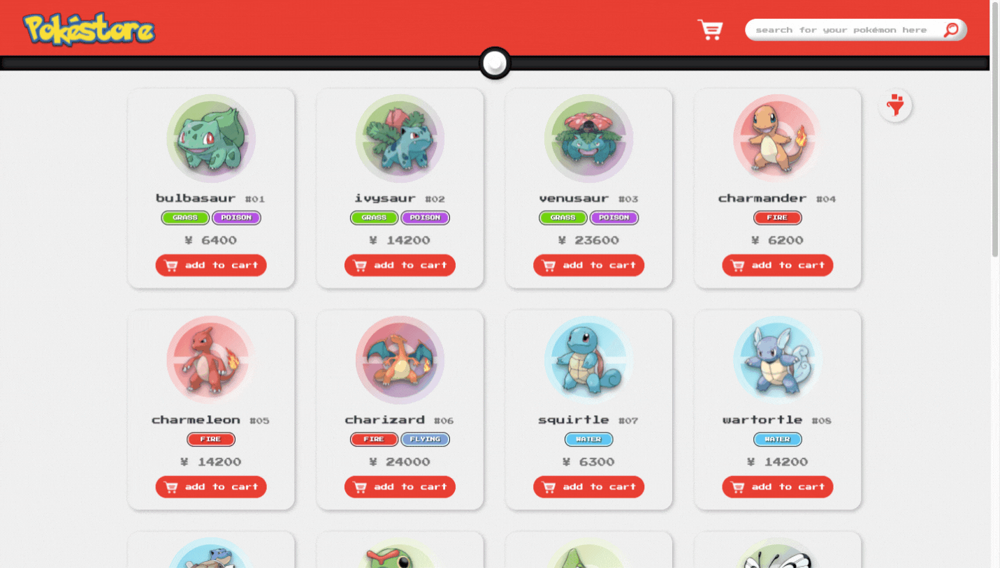

<h1 align="center"></h1>
<h1 align="center"></h1>
<p align="center">This project is a Pokémon Store! Inspired in e-commerce aplications, <strong>Pokéstore</strong> simulates a real shopping experience. Search for your favourite pokémon and add them to cart. When satisfied, go to checkout and complete your purchase.<br/>
<strong>Gotta catch’em all! :)</strong></p>

## 🔖 Layout

<br/>
<p>The project layout was made on <a href="https://www.figma.com/">Figma</a>. You can access it throught this <a href="https://www.figma.com/file/QGPdksh8WTsXjlXunieGZz/Pok%C3%A9store?node-id=0%3A1">link</a>.<br/>
Remembering that you need to have a <strong>Figma account</strong> to access it.</p><br/>

## ⚡ Pokestore Api

<br/>
<p>For this project, I created an API with Express.js and MongoDB. Got data from <a href="https://pokeapi.co/">PokeApi</a> and created my own api with a customized price property and new Query Params. You can access and fetch it throught this <a href="https://pokestore-api.herokuapp.com/">link</a>. To access the repository in github, <a href="https://github.com/eduardaterra/pokestore-api">click here</a>.</p><br/>

## 🧩 Tecnologies

<br/>

<li><a href="https://www.typescriptlang.org/">Typescript</a></li>
<li><a href="https://reactjs.org/">ReactJS</a></li>
<li><a href="https://reactrouter.com/">React Router Dom</a></li>
<li><a href="https://axios-http.com/">Axios</a></li>
<li><a href="https://styled-components.com/">Styled Components</a></li>
<br/>

## 🌱 Getting started

<br/>
<p>You can access the deployed project by clicking <a href="https://pokestore-app.herokuapp.com/">here</a>.<br>
<br>
<p>Also, you can clone the repository and access the files. You will need to have installed <a href="https://nodejs.org/en/">Node.js</a>.

```bash
$ git clone https://github.com/eduardaterra/pokestore.git
```

<p>To initiate the project, you have to access the file, install the dependencies and start with <a href="https://www.npmjs.com/">NPM.</a></p>

```bash
$ cd pokestore

$ npm install

$ npm start
```

<p>The app will be available in your browser by the address <a href="http://localhost:3000">http://localhost:3000</a></p><br/>

## 🚧 Pending Task

<br/>
<li>Responsiveness</li>
